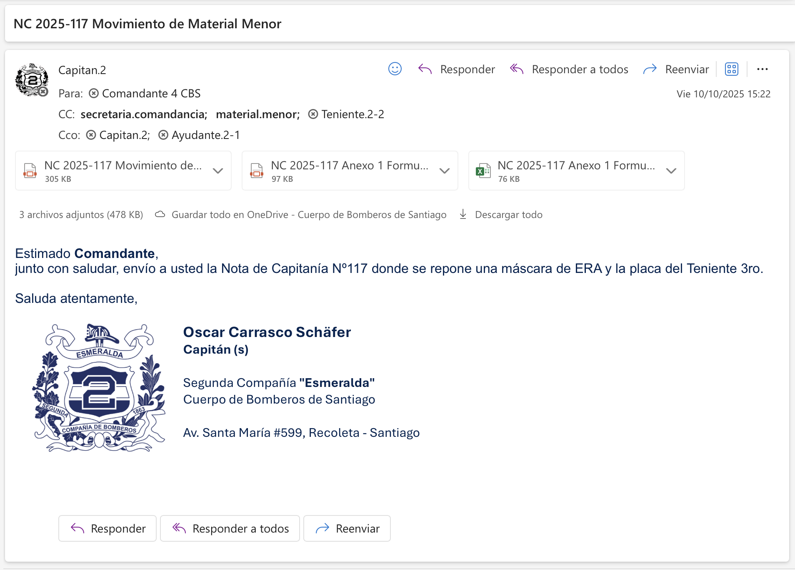

# Notas de Capitania

Las **Notas de Capitania** son la forma de comunicación con el resto del mundo, lo más frecuente (+100 al año) es despacharla a la Comandancia, o sea, a alguno de los Comandante, sin embargo también hay otros destinatarios comunes como el Secretario General para las asistencias mensuales.

:::tip
La Orden del Día del Comandante N°. 152/2011 aborda estos temas por lo que también es una lectura recomendada si desea hacerlo.
:::

## Nombre del archivo

Personalmente, siempre utilice la formula `NC YYYY-XXX Asunto`, por ejemplo `NC 2025-119 Solicita dias compensados para cuartelero`, aunque la Orden del Día del Comandante N. 152/2011 sugiere el uso de `CAP 02 CIA N° 0119/2025` no obliga a hacerlo. Cada uno es libre de usar su formato mientras sea **entendible**.

## Composicion del documento
Existe una plantilla vacia, que espero con el tiempo siga siendo fácil de encontrar y a partir de esa puedes empezar a escribir, pero aquí igualmente detallare todo lo que debe de llevar.

[**1.**](#correlativo-materia-y-referencia) Debe ir el **correlativo**, la **materia** y la **referencia** que utilizaras.

[**2.**](#) La fecha, es importante que corresponda con el envio del correo.

[**3.**](#destinatario) El destintario, usualmente es un Oficial General, pero puedes encontrar mas informacion en [Destinatario](#destinatario)

[**4.**](#) El contenido, el cuerpo de la Nota explicando lo que quieres informar.

[**5.**](#) La firma del Capitán (o quien haga sus veces)

[**6.**](#) Con Copia a quienes.

[**7.**](#) La abreviaturas del Capitan (en mayusculas) seguidas de las del Ayudante (en minusculas) ~para saber a quien culpar~

### Correlativo, materia y referencia

:::danger
Estos puntos son las principales **faltas** en la [Revista de Cuarteles](../revista_cuarteles.md), asi que hay que tener especial cuidado en que esten bien.
:::

El **correlativo** es el número de Nota de Capitanía que estas enviando, es importante verificar que **no existan dos Notas con el mismo correlativo** y también **no saltarse ningún correlativo**.

:::info
Para conocer más sobre las referencias puedes echarle un vistazo a [Lista de referencias](../lista_referencias.md))
:::

#### Tipos de Notas

**No todas las Notas de Capitania son iguales**, no tienen el mismo "tipo" de correlativo ni tienen el mismmo [destinatario](#destinatario), de momento encontre que la mejor forma de dividirlas es la siguiente:
- **Notas de Capitania a Comandancia (NC)**: Estas son las que se dirigen a cualquiera de los cuatro comandantes, las que si o si deben ser copiadas a Secretaria de Comandancia para que ellos lleven el control interno.
- **Notas de Capiania a Secretaria General (NSG)**: Estas se dirigen al Secretario General, no son tantas y principalmente corresponden al Parte Mensual de Asistencia y a la Asistencia de Otras Compañías.
- **Notas de Capitania a Otras Secretarias (NCOS)**: Van dirigidos a **otros**, y el correlativo es solo para un orden interno del Ayudante, por ejemplo comunmente necesitaras enviarlas al Intedente General, Vicesuperintedente, etc...
- **🚧 Notas de Capitania a externos (CAP) 🚧**: Las cree recientemente con motivo de necesitar enviar correspondencia fuera de la Compañía y el Cuerpo, como Compañías de Canje, Municipalidad, etc... **Aun hay que evaluar su uso**

:::tip
Tiene relación con [Sistema de Archivos](#), que es una lectura recomendada sobre como guardar los documentos y archivos para que sea sencillo encontrarlos.
:::

### Destinatario
El destinatario puede ser otro error con el que se encuentren los primeros en tocar la Ayudantía, este punto se complementa muy bien con [Tipos de Notas](#tipos-de-notas)

De forma general, se compone de cuatro lineas:
- **Señor/a**
- **Nombre de la persona**
- **Cargo**
- Institucion

La institución usualmente será el mismo Cuerpo de Bomberos de Santiago.

:::info
**Todas las Notas de Capitanía a Comandancia deben ser dirigidas a un Comandante**, si no se envia a un Comandante, no es una NC.  

Puedes leer más en la sección de [Envio](#envio)
:::

### Contenido y firma
Aqui no hay mucho que explicar, es el espacio para ahondar sobre lo que se quiere comunicar, y despues debe ir firmado por el Capitán o quien haga sus veces en caso de existir subrogancias.

### Con copia
:::danger
**Todas las Notas de Capitania a Comandancia** deben ser copiadas a Secretaria de Comandancia *(secretaria.comandancia@cbs.cl)* sin expceción alguna. Personalmente tambien los copio en las NSG pero no es necesario.
:::

Para evitar errores, en el mismo documento (aparte de en el correo electronico) se especifica a quien se le quiere copiar esta Nota, usualmente las Ordenes del Día que se usan de referencia especifican a quien se debe copiar, pero además se pueden agregar otras como por ejemplo a Oficiales de Compañía.

:::tip
En el caso de ejemplo, la referencia dice que debe ser copiado a Secretaria de Comandancia y Servicios Administrativos, sin embargo aquí decidi copiar al Primer Maquinista igualmente ya que el es el encargado de los cuarteleros.
:::

## Anexos
Una gran parte de la correspondencia despachada debe de ir acompañada de anexos, archivos que te permitiran complementar la información entregada, inclusive en algunos casos es obligatorio adjuntar anexos.

Los anexos pueden ser tan variados que no puedo especificar muchos, lo que si es importante es saber que el nombre del archivo debe ser **`NC 2025-102 Anexo 1 <Titulo>`**, como por ejemplo `NC 2025-117 Anexo 1 Formulario Movimiento Inventario Material Menor`

:::danger
La Orden del Día del Comandante N°. 152/2011 dice que **todos los anexos** tambien deben ser enviados en formato `.pdf` en caso de no serlos naturalmente.  
Por ejemplo, en el caso de enviar un formulario de material menor que es excel, debe ir acompañado de ese mismo archivo pero en formato `.pdf` resultando con `NC 2025-117 Anexo 1 Formulario Movimiento Inventario Material Menor.xslx` y `NC 2025-117 Anexo 1 Formulario Movimiento Inventario Material Menor.pdf`
:::

## Envio
No sirve de nada confeccionar una Nota si no va a ser enviada, así que este es el momento de enviarla y aquí la información mas importante.

	- **Para**: Solo hay un [destinatario](#destinatario) posible, y es el único que debería estar en esa sección.
    - **Con copia (CC)**: El o los departamentos que necesiten estar en conocimiento de esta información, además de otros oficiales como ya se vio en [su sección](#con-copia)
    - **Con copia oculta (CCO)**: Agrego al Capitan y al Ayudante, para poder tener un respaldo y guardarlo en las mismas carpetas de Outlook, ocasionalmente cuando se trata de algún voluntario como por ejemplo en las excusas para cursos también pueden ir aquí.
    - **Asunto**: El mismo nombre que el del archivo de la Nota
    - **Contenido**: Estimado, que nota se envia, un breve resumen de ser posible, se despide y la firma.

:::info
Todos los correos deben ser despachados desde el correo del Capitán, no se aceptan correos desde cuentas de los ayudantes.
:::

:::info
El plazo vence a las 21:00 horas, si se envia el 02/feb a las 21:02 horas quedará como enviado el 03/feb **para efectos de faltas por plazos**.
:::

### Ejemplo

