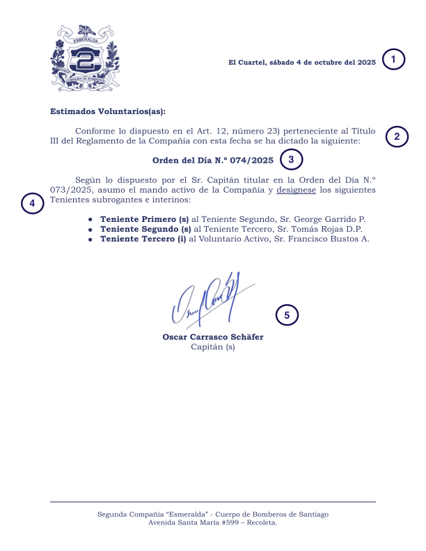

# Ordenes del Día

Tranquilidad, son mucho más sencillas que las [Notas de Capitania](./notas_de_capitania.md).
Las ordenes del dia no se encuentran definidas en ningún lado, solamente mencionadas en los reglamentos, así que le pedi a una [IA](https://gemini.google.com/) que me dijera que es, y este es el resultado:

<blockquote>
En el contexto de bomberos, una Orden del Día es un documento oficial emitido por la autoridad o mando (como el Comandante o el Capitán) de una institución o compañía de bomberos.

Funciona como un comunicado formal y directriz que se utiliza para:

- Impartir instrucciones: Establecer procedimientos, normas, disposiciones operacionales o administrativas.

- Informar decisiones: Comunicar ascensos, nombramientos, felicitaciones, o sanciones.

- Establecer protocolos: Detallar cómo actuar en ciertas situaciones o el uso de equipos (como códigos de radio o claves de comunicación).

- Resaltar logros o eventos: Reconocer el trabajo realizado, o anunciar fechas y actividades importantes.
</blockquote>

Que me parece un buen resumen.

## Composicion del documento

1. La fecha en la que se publica.
2. El marco de referencia, aqui no es necesario ser tan especifico, inclusive se puede poner simplemente Art. 12 (que habla de los deberes del Capitán)
3. Correlativo, importante, al igual que el de las Notas de Capitania.
4. Los contenidos, lo que se quiere dictar y hacer valido desde la publicación.
5. La firma del Capitán (subrogante en este ejemplo)

--- 

Me parece que no es necesario profundizar tanto en este tema, ya que son bastante simples en su forma más no en su fondo.