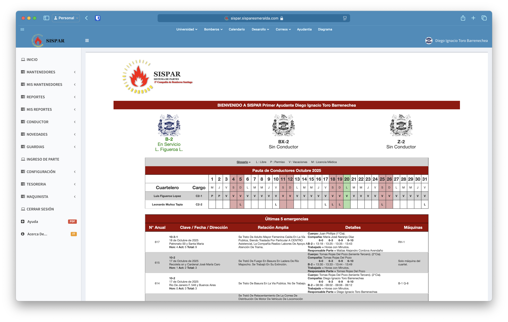

# SISPAR
:::warning
Esta seccion (y sus hijos) aun se encuentran en construccion, asi que la informacion no esta del todo completa, puedes contribuir a su crecimiento en [Aportes](../intro.md#Aportes)
:::
**SISPAR** es el Sistema de Partes, una herramienta informática desarrollada de forma externa y que se encuentra implementada actualmente en más de la mitad del CBS (incluyendo en la propia Comandancia), por lo que es una parte vital.

Gracias a SISPAR las condiciones de vida del ayudante se han visto drasticamente mejoradas, ya que hace una gran parte del trabajo que antes debia ser hecho a mano.

```mdx-code-block
import DocCardList from '@theme/DocCardList';

<DocCardList />
```

