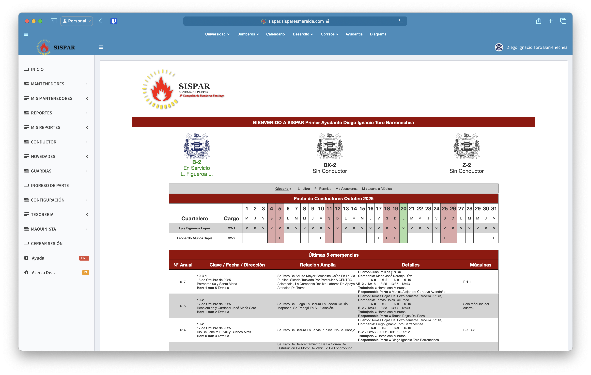

# Que es
**SISPAR** es el Sistema de Partes, una herramienta informática desarrollada de forma externa y que se encuentra implementada actualmente en más de la mitad del CBS (incluyendo en la propia Comandancia), por lo que es una parte vital.

Gracias a SISPAR las condiciones de vida del ayudante se han visto drasticamente mejoradas, ya que hace una gran parte del trabajo que antes debia ser hecho a mano.

