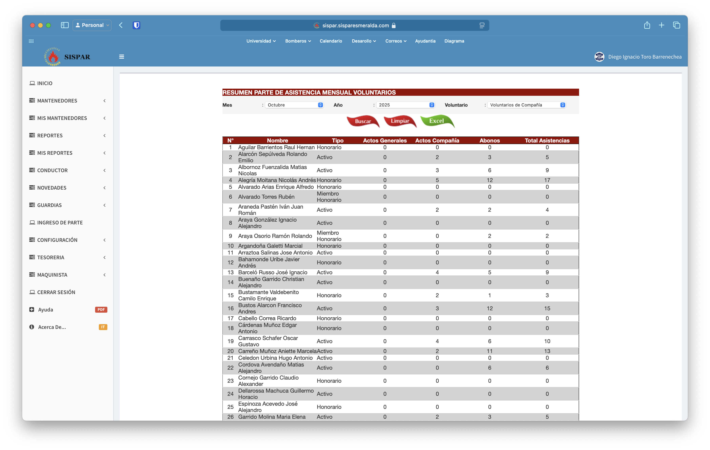
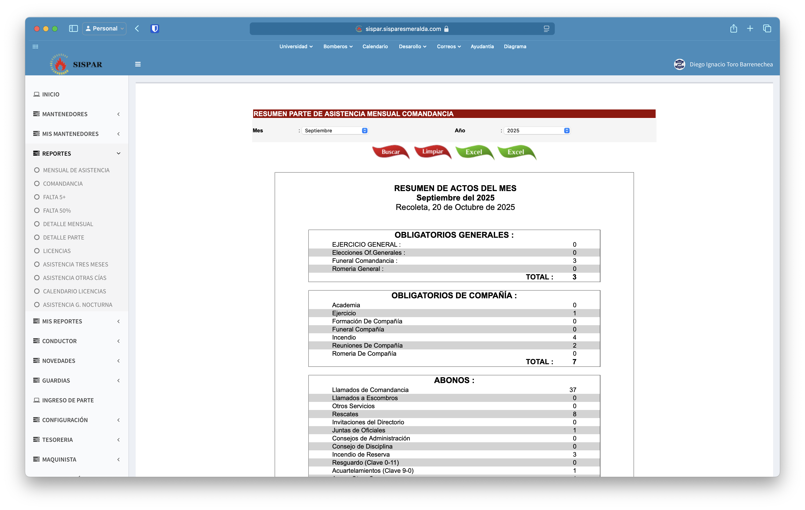
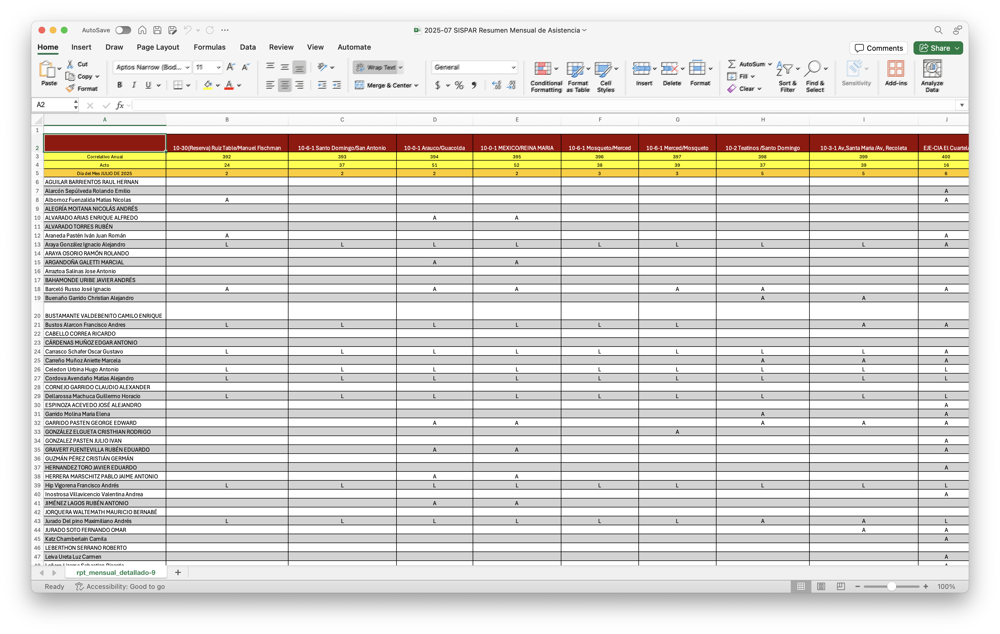

# Reportes
Esta sección esta llena de herramientas muy utiles.

## Mensual de asistencia

Utilizado para la elaboracion del PMA, separa la asistencia en tres categorias, **Obligatorios generales, Obligatorios de Compañía y Abonos**, se puede exportar a Excel.

## Comandancia

Tambien utilizado para el PMA, detallada la cantidad de actos según su tipo, tambien exportable a Excel.

## Detalle mensual

Como el mensual de asistencia, pero mucho mas detallado, una fila por cada voluntario y una columna por cada lista/acto de servicio.